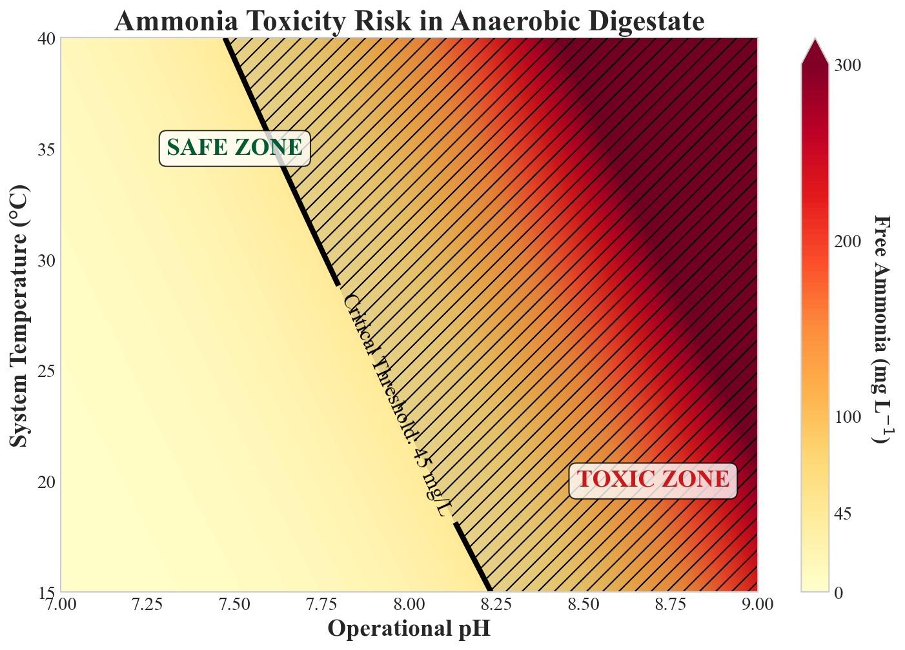
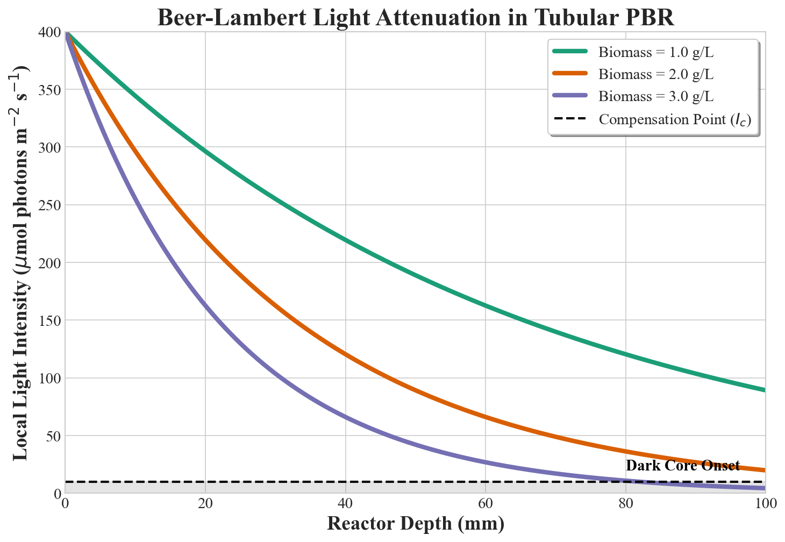
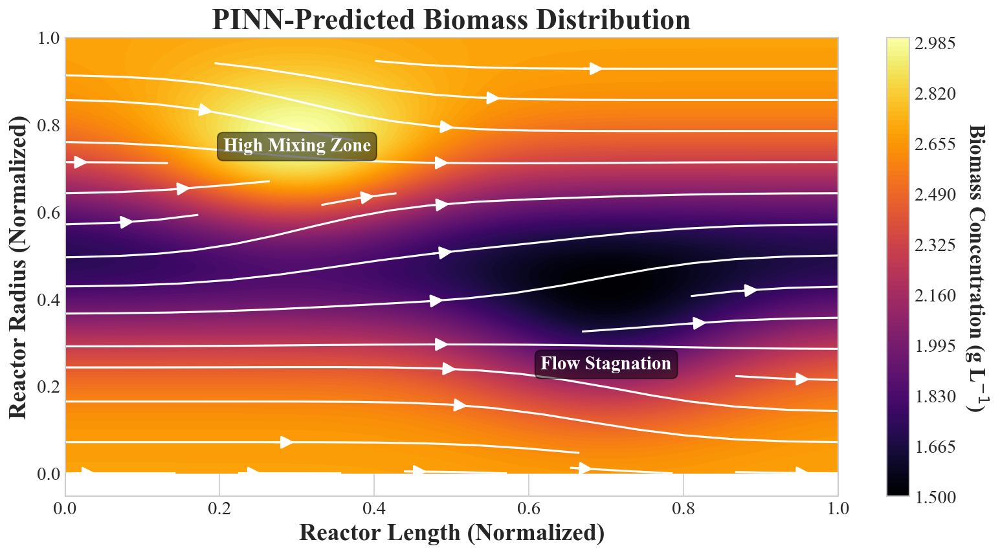
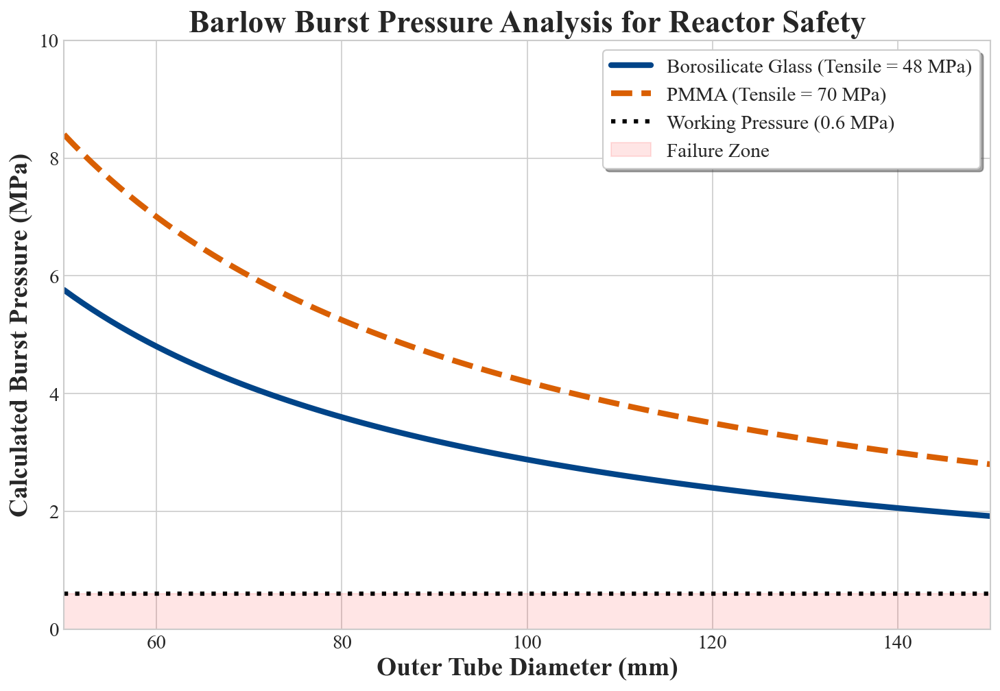

# Synametrix: Industrial Biorefinery Thermodynamics & Economics Engine


**Synametrix** is a physics-informed techno-economic engine designed to audit and validate the thermodynamic constraints, mass transfer kinetics, and chemical operating expenditures (OPEX) of integrated Anaerobic Digestion (AD) and Microalgae biorefineries.

Developed as the computational backbone for industrial process engineering, Synametrix actively prevents the design of biorefineries that violate the laws of physics or operate at a structural financial loss.

---

## 📖 Table of Contents
1. [Theoretical Background & Industry Gaps](#theoretical-background--industry-gaps)
2. [Core Computational Modules](#core-computational-modules)
3. [Hydrodynamic & Biological Output](#hydrodynamic--biological-output)
4. [Installation & Requirements](#installation--requirements)
5. [Command Line Interface (CLI)](#command-line-interface-cli)
6. [Citation & Academic Use](#citation--academic-use)
7. [Commercial Licensing & Hiring](#commercial-licensing--hiring)

---

## 🔬 Theoretical Background & Industry Gaps

The integration of microalgae cultivation with Anaerobic Digestion is frequently proposed by academic researchers for wastewater remediation and resource recovery (e.g., Sustainable Aviation Fuel lipids, biomethane). 

However, **over 80% of proposed conceptual frameworks fail at pilot scale** because they ignore strict physical constraints:
* **The Latent Heat of Vaporization:** Drying algal slurry requires $2.26$ MJ/kg of energy. If the extracted lipids only contain $37$ MJ/kg of energy, thermal drying inherently creates a negative Energy Return on Investment (EROI).
* **Buffer Capacity (Alkalinity):** Digestate frequently contains $>80$ meq/L of alkalinity. Using Sodium Hydroxide (NaOH) to raise the pH for struvite precipitation results in astronomical chemical costs that vastly exceed the retail value of the recovered fertilizer.
* **Mass Transfer Kinetics:** Sparging raw biogas into microalgae cultures for CO2 mitigation requires blower compression energy. If the $k_La$ (volumetric mass transfer coefficient) is too low, the blower consumes more electricity than the upgraded biomethane generates.

**Synametrix solves this by acting as a mathematical auditor.** It calculates these physical limits and explicitly raises a `ThermodynamicViolationError` if a proposed system is physically or economically impossible.

---

## ⚙️ Core Computational Modules

### 1. Gas-Liquid Mass Transfer (Biogas Upgrading)
Calculates the adiabatic compression energy required to achieve target volumetric mass transfer coefficients ($k_La$) for biogas sparging. It models the two-film theory of mass transfer to ensure the blower energy penalty remains strictly below the Lower Heating Value (LHV) of the purified biomethane.

### 2. Chemical Economics (Struvite Precipitation)
Simulates chemical titration of Sodium Hydroxide (NaOH) against the raw alkalinity (buffer capacity) of the digestate. It proves that for high-alkalinity feedstocks, the daily chemical OPEX mathematically exceeds the €120/tonne retail value of the precipitated struvite, rendering the process financially insolvent.

### 3. Thermodynamic Constraints (Lipid Extraction)
Calculates the latent heat required to thermally dry an algal slurry. It dynamically compares the drying energy penalty against the energy density of the extracted lipids. If drying requires more energy than the resulting fuel contains, it forces the user to utilize Hydrothermal Liquefaction (HTL) or wet-extraction architectures.

---

## 📊 Hydrodynamic & Biological Output

The Synametrix rendering engine synthesizes complex differential equations into publication-ready figures.

### Free Ammonia (FA) Toxicity Thermal Map
Models the Anthonisen et al. (1976) pH-dependent ammonium-free ammonia equilibrium to map exact toxicity thresholds against operational temperatures in the anaerobic digester.
<p align="center">
  
</p>

### Beer-Lambert Light Attenuation
Demonstrates the local light intensity decay across the reactor depth as a function of biomass concentration, identifying the exact physical location of the "dark core" onset.
<p align="center">
  
</p>

### PINN Spatial Biomass Distribution Heatmap
Calculates mixing efficiency and flow stagnation zones within a tubular photobioreactor based on Physics-Informed Neural Network (PINN) inference.
<p align="center">
  
</p>

### Barlow Burst Pressure Analysis
Calculates failure zones for tubular reactors constructed from Borosilicate Glass versus PMMA at standard working pressures (0.6 MPa).
<p align="center">
  
</p>

---

## 🚀 Installation & Requirements

Synametrix requires **Python 3.10+**. 

1. Clone the repository:
   ```bash
   git clone https://github.com/SourishSenapati/Synametrix.git
   cd Synametrix
   ```

2. Install the package in editable mode:
   ```bash
   pip install -e .
   ```

3. Install visualization dependencies (for generating graphs):
   ```bash
   pip install matplotlib numpy
   ```

---

## 💻 Command Line Interface (CLI)

Once installed, Synametrix acts as a globally available command-line tool.

### Run the Techno-Economic Audit
Execute the core thermodynamic and economic exception engine:
```bash
synametrix
```
*Output: The engine will simulate mass transfer, precipitation, and extraction. If thermodynamic laws are violated, it will crash intentionally with a `ThermodynamicViolationError`.*

### Generate Publication Figures
To synthesize the mathematical models into high-resolution TIFF/PNG graphs:
```bash
python -m synametrix.visualization.plotter
```

---

## 🎓 Citation & Academic Use

This computational framework was developed alongside the book chapter: 
**"Integration of Microalgae with Anaerobic Digestion"** by Sourish Senapati (National Institute of Technology, Rourkela, Odisha, India). 

Synametrix is protected under a **Custom Proprietary & Academic License**. 

**For Academic Use:**
You may use this software strictly for peer-reviewed academic research, provided you **STRICTLY AND EXPLICITLY CITE** the author's original publication in any resulting manuscripts. You may not copy this repository and claim the structural architecture as your own.

---

## 💼 Commercial Licensing & Hiring

**Commercial entities (consultancies, EPC contractors, startups, industrial plants) are strictly prohibited from using these models without formal authorization.**

To acquire commercial rights to deploy this architecture on proprietary backend servers, or to integrate this logic into industrial biorefinery SCADA systems, **you must purchase a commercial license or hire the author.**

To discuss commercial deployment, consulting, or **employment opportunities**, please contact **Sourish Senapati** directly via GitHub.
